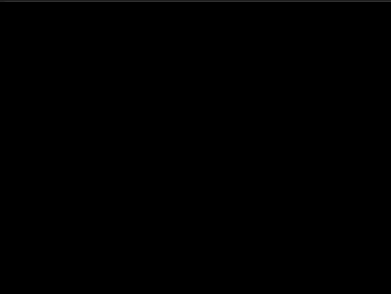

# Security System

This program takes input from cameras, detects motion and sends an e-mail to given e-mail addresses when it detects motion.

It serves a web server and a web app used to change the settings and view informations.

---

It uses Rust because I want to learn Rust and I want the software to run fast.

It is published under the MPL 2.0 license.

---

## Using it

You'll need to build the program (see the Building section below).
You'll also need to put a config.toml file in your working directory and fill it with the informations as in this [example file](docs/config-example.toml).

## Building

To build this program, please install the following dependencies. Please note that I only tested it on my machine (Ubuntu 20.04), for now, but it *should* be cross-platform. Please feel free to give me feedback on how it builds *or not* on your platform.

### opencv

You will need the opencv development libraries to build this project. If your OS uses the APT package manager, you can install all opencv libs like that :

```shell
	$ sudo apt-get install libopencv-*
```

Otherwise, you can visit the [opencv releases page](https://opencv.org/releases/) to get packages for your platform.

### libclang and clang

You will need to install a libclang package and clang binaries. I personally did this with APT :

```shell
	$ sudo apt-get install libclang-*
	$ sudo apt-get install clang
```

Otherwise you can install it from [the llvm download page](https://releases.llvm.org/download.html).

---

## How does it work ?

### November 29th, 2020

I use opencv to get the default camera's input.

It continually compares the image from the camera and the last image it got from the camera. It computes the difference and applies a threshold, giving this type of images :



The pixels in white are the pixels that changed, therefore if there are white pixels, there is movement.

### December 1st, 2020

I use the [lettre](https://crates.io/crates/lettre) crate to send e-mails. I added a toml config file that is read when sending e-mails to know which e-mail addresses to use. See [config-example.toml](docs/config-example.toml) to know how to fill it. For now, the e-mail address from which you send the alerts needs to be a gmail address, and you need to activate [less secure apps](https://support.google.com/accounts/answer/6010255?hl=en) for it to allow the program to send an email with it.